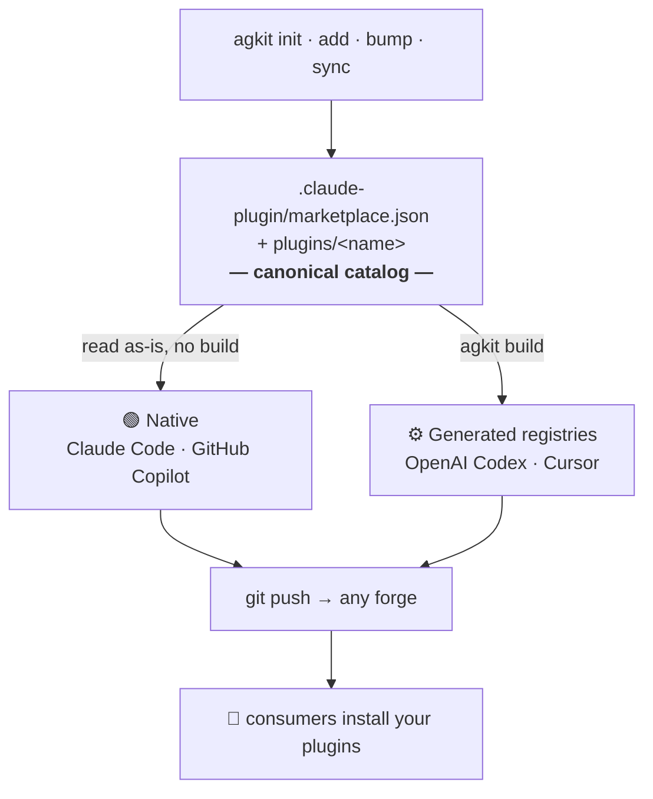

<div align="center">

# **AG**ent marketplace **KIT**

**One canonical catalog → every AI coding agent → any Git forge.**

Scaffold and manage **plugin marketplaces for Claude Code · GitHub Copilot · OpenAI Codex · Cursor**,
distributed through **any Git host** — GitHub, GitLab, Bitbucket, Gitea, or a self‑hosted forge.

[](https://www.npmjs.com/package/agkit)
[](https://www.npmjs.com/package/agkit)
[](https://github.com/Fairen/agkit/actions/workflows/ci.yml)
[](https://nodejs.org)
[](LICENSE)

*`init` · `add` · `build` · `sync` · `bump` · `validate` · `list`*

</div>

> [!NOTE]
> Unofficial community tool, not affiliated with Anthropic, GitHub, OpenAI, or Cursor.

Think **`ng` for Angular, but for agent plugin marketplaces**: `init` gives you a push‑ready repository, and `add` / `build` / `sync` / `bump` / `validate` cover the whole life of the project afterwards.

---

## ✨ Why agkit

- 🧩 **Multi‑agent** — one repository serves Claude Code, GitHub Copilot, OpenAI Codex, and Cursor.
- 🌐 **Forge‑agnostic** — distribute via GitHub, GitLab, Bitbucket, Gitea, or self‑hosted, with a plain `git push`.
- 📁 **One source of truth** — a single canonical `.claude-plugin/marketplace.json`; generated registries derive from it and never drift.
- 🔁 **Full lifecycle** — `init`, `add`, `build`, `sync`, `bump`, `validate`, `list`.
- 🧬 **Remote & local templates** — pull plugin templates from any git repo (`gh:` / `gl:` / URL) or a local path.
- ✅ **CI‑ready** — generated GitHub Actions / GitLab CI, with `validate` + `build --check` gates.

---

## 📦 Installation

Requires **Node.js ≥ 18**. Run it on demand with `npx` (nothing to install), or install the CLI globally:

```bash
npx agkit --help          # run without installing
npm install -g agkit      # or install the `agkit` command globally
```

---

## 🚀 Quick start

Create and distribute your first marketplace in **four steps**:

```bash
npx agkit init my-marketplace   # 1. scaffold a push-ready repository
cd my-marketplace
agkit add skill tdd-coach       # 2. add a plugin from a built-in template
agkit validate                  # 3. check the catalog is valid
git remote add origin <your-git-url>
git add -A && git commit -m "feat: initial marketplace" && git push -u origin main   # 4. distribute via git
```

That's the whole loop — once pushed, anyone can install your plugins straight from the repo (the per‑agent install command is in the **Create a marketplace for your agent** section below). `init` targets **Claude Code** and **GitHub Copilot** by default; add `--agents codex,cursor` to serve more.

---

## 🧩 How agents consume your marketplace

agkit always writes **one canonical catalog** — `.claude-plugin/marketplace.json` — plus your plugins under `plugins/<name>/`. That catalog is the single source of truth. How each agent reads it falls into two groups:



- 🟢 **Native (no build step)** — **Claude Code** and **GitHub Copilot** read `.claude-plugin/marketplace.json` directly. Push the repo and it installs.
- ⚙️ **Generated registry (`agkit build`)** — **Codex** and **Cursor** install from their own committed registry, which `agkit build` derives from the same canonical catalog. You run `agkit build` once to enable a target; after that `add` / `bump` / `sync` keep it fresh automatically.

> [!TIP]
> You can target several agents from a single repository — the plugin content under `plugins/` is shared across all of them.

---

## 🎯 Create a marketplace for your agent

Choose targets at init with `--agents`. Every flow ends with a normal `git push`; distribution works from any forge.

| Agent | Type | `agkit build`? | Consumers install with |
| :---- | :--- | :------------: | :--------------------- |
| **Claude Code** | 🟢 Native | — | `/plugin marketplace add …` |
| **GitHub Copilot** | 🟢 Native | — | `copilot plugin marketplace add …` |
| **OpenAI Codex** | ⚙️ Generated | ✅ | `codex plugin marketplace add …` |
| **Cursor** | ⚙️ Generated | ✅ | add in Cursor, then install by name |

<details open>
<summary><b>🤖 Claude Code</b> — native, nothing to generate</summary>

<br/>

```bash
agkit init my-marketplace --agents claude-code
cd my-marketplace
agkit add skill my-skill
agkit validate
git remote add origin <your-git-url>
git add -A && git commit -m "feat: initial marketplace" && git push -u origin main
```

Consumers install in a Claude Code session:

```text
/plugin marketplace add <owner/repo or git URL>
/plugin install my-skill@my-marketplace
```

</details>

<details>
<summary><b>🐙 GitHub Copilot</b> — native, same repo as Claude Code, no build</summary>

<br/>

The default init already includes Copilot; to target it explicitly use `--agents copilot` (or `--agents claude-code,copilot`).

```bash
agkit init my-marketplace --agents claude-code,copilot
cd my-marketplace
agkit add skill my-skill
agkit validate
git add -A && git commit -m "feat: initial marketplace" && git push -u origin main
```

Consumers install from the shell (or with `/plugin marketplace add` inside a session):

```bash
copilot plugin marketplace add <owner/repo or git URL>
copilot plugin install my-skill@my-marketplace
```

</details>

<details>
<summary><b>🧠 OpenAI Codex</b> — installs from a generated registry</summary>

<br/>

Codex installs from its own registry, which `agkit build` generates from the catalog.

```bash
agkit init my-marketplace --agents codex
cd my-marketplace
agkit add skill my-skill
agkit build          # generates .agents/plugins/marketplace.json + plugins/<name>/.codex-plugin/plugin.json
agkit validate
git add -A && git commit -m "feat: initial marketplace" && git push -u origin main
```

Consumers install with:

```bash
codex plugin marketplace add <owner/repo or git URL>
```

The Codex registry format follows the official Codex plugin docs (`.agents/plugins/marketplace.json` with `source: { source: "local", path }`, `policy`, and `category`). Commit the generated files so consumers can install.

</details>

<details>
<summary><b>🖱️ Cursor</b> — installs from a generated registry</summary>

<br/>

Cursor installs from a committed `.cursor-plugin/` registry, also generated by `agkit build`.

```bash
agkit init my-marketplace --agents cursor
cd my-marketplace
agkit add skill my-skill
agkit build          # generates .cursor-plugin/marketplace.json + plugins/<name>/.cursor-plugin/plugin.json
agkit validate
git add -A && git commit -m "feat: initial marketplace" && git push -u origin main
```

Consumers add the marketplace in Cursor, then install the plugin by name.

</details>

<details>
<summary><b>🌈 Several agents at once</b> — one repository serves them all</summary>

<br/>

```bash
agkit init my-marketplace --agents claude-code,copilot,codex,cursor
cd my-marketplace
agkit add skill my-skill
agkit build          # generates the Codex and Cursor registries; Claude Code and Copilot need none
agkit validate
git add -A && git commit -m "feat: initial marketplace" && git push -u origin main
```

</details>

---

## 🛠️ Commands

| Command | What it does |
| :------ | :----------- |
| `agkit init [dir]` | Scaffolds a git-first marketplace: `.claude-plugin/marketplace.json` (with `$schema`, `pluginRoot`, `targets`), `plugins/`, `AGENTS.md`, a per-agent README, `examples/team-settings.json`, CI (GitHub Actions or GitLab CI), `.gitignore`, `git init`. Pick target agents with `--agents` (see the **Target agents** section). Non-interactive with `-y`. |
| `agkit add <template\|spec> <name>` | Scaffolds a plugin from a built-in template (`skill`, `command`, `agent`, `hook`, `mcp`) **or a remote/local one** — `gh:owner/repo/dir#ref`, `gl:owner/repo`, any git URL with `//subdir` and `#ref`, or a local path. Registers it in the catalog and refreshes the README plugin table. |
| `agkit build [--target] [--check]` | Generates the registries for **Codex** and **Cursor** from the catalog: their committed `marketplace.json` + per-plugin manifest mirrors. Default targets are the ones in `metadata.targets`; `--target codex,cursor` overrides. `--check` fails on drift (CI). |
| `agkit bump [plugin] [level]` | Bumps a plugin version from conventional commits scoped to its directory since the last `<plugin>@x.y.z` tag (`feat`→minor, breaking→major, else patch), or an explicit `major\|minor\|patch`. `--tag` commits and tags; `--dry-run` previews. Catalog, README, and any built registries stay in sync. |
| `agkit sync` | Reconciles the catalog with what's on disk. Source of truth: each plugin's `.claude-plugin/plugin.json`. Adds missing entries, fixes drift, flags orphans, regenerates the README table, and refreshes any already-built Codex/Cursor registry. |
| `agkit validate [--strict]` | Local checks (JSON validity, kebab-case, reserved names, source resolution, manifest presence, version drift) plus delegation to `claude plugin validate` when the Claude Code CLI is installed (`--strict` forwarded). Non-zero exit on error — CI-ready. |
| `agkit list` | Lists available plugin templates. |

---

## 🤖 Target agents

`agkit init --agents <list>` records the agents you want to serve and adapts the scaffold. Default: `claude-code,copilot`.

| Agents | How agkit serves them |
| :----- | :------------------- |
| **Claude Code, GitHub Copilot** | Native. The catalog is read as-is — per-agent install docs and the team-settings path are wired at init, nothing to generate. |
| **Codex, Cursor** | `agkit build` generates the committed registry + per-plugin manifest mirrors from the catalog. `sync`/`add`/`bump` keep it fresh once built. |

Every init also writes a root `AGENTS.md`, read natively by most agents for repository context.

---

## 🔄 Keeping registries fresh

Generation is opt-in: run `agkit build` once to enable Codex/Cursor. From then on, `agkit add`, `agkit bump`, and `agkit sync` refresh the generated registries automatically, so they never drift as plugins change. In CI, run `agkit build --check` to fail the build if a committed registry is out of date (the generated GitHub Actions / GitLab CI workflows already do this).

---

## 🧬 Team templates (remote or local)

Version your team's plugin templates in any git repository and consume them from every marketplace:

```bash
agkit add gh:my-org/plugin-templates/kata-fr gilded-rose
agkit add "https://gitlab.company.io/craft/templates//skill-ddd#v2" tactical-ddd
agkit add ./shared-templates/hook-guard no-secrets
```

A template is any directory containing `.claude-plugin/plugin.json` (adopted, `name` rewritten) or `plugin.json.tpl`. Files ending in `.tpl` are rendered with `{{pluginName}}`, `{{pluginTitle}}`, `{{description}}`, `{{authorName}}` — in contents **and** in file/directory names. Executable bits are preserved.

---

## 🌐 Forge-agnostic by design

`init` parses your git remote (https, ssh, scp-style) regardless of host. On github.com it uses the `owner/repo` shorthand and `{"source": "github"}` team settings; everywhere else it emits the git URL form — which every supported agent accepts for any forge.

---

## 👥 Team setup (automatic installation)

`init` writes `examples/team-settings.json` with an `extraKnownMarketplaces` block. Drop it into the settings file for each agent so teammates get the marketplace automatically when they trust the repository — `.claude/settings.json` for Claude Code, `.github/copilot/settings.json` for GitHub Copilot.

---

## 📄 License

[MIT](LICENSE) © fair3n

<div align="center">
<sub>Built for the age of AI coding agents. Ship a marketplace, not a config.</sub>
</div>
