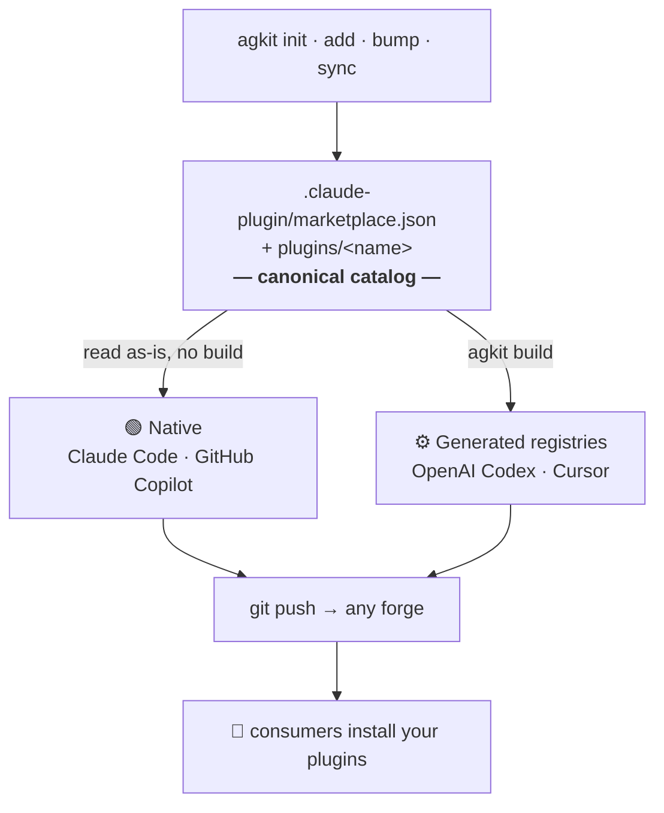

<div align="center">


# **AG**ent marketplace **KIT**

**One canonical catalog → every AI coding agent → any Git forge.**

Scaffold and manage **plugin marketplaces for Claude Code · GitHub Copilot · OpenAI Codex · Cursor**,
distributed through **any Git host** — GitHub, GitLab, Bitbucket, Gitea, or a self‑hosted forge.

[](https://www.npmjs.com/package/agkit)
[](https://www.npmjs.com/package/agkit)
[](https://github.com/Fairen/agkit/actions/workflows/ci.yml)
[](https://nodejs.org)
[](LICENSE)

*`init` · `add` · `build` · `sync` · `bump` · `validate` · `list`*

</div>

> [!NOTE]
> Unofficial community tool, not affiliated with Anthropic, GitHub, OpenAI, or Cursor.

Think **`ng` for Angular, but for agent plugin marketplaces**: `init` gives you a push‑ready repository, and `add` / `build` / `sync` / `bump` / `validate` cover the whole life of the project afterwards.

---

## ✨ Why agkit

- 🧩 **Multi‑agent** — one repository serves Claude Code, GitHub Copilot, OpenAI Codex, and Cursor.
- 🌐 **Forge‑agnostic** — distribute via GitHub, GitLab, Bitbucket, Gitea, or self‑hosted, with a plain `git push`.
- 📁 **One source of truth** — a single canonical `.claude-plugin/marketplace.json`; generated registries derive from it and never drift.
- 🔁 **Full lifecycle** — `init`, `add`, `build`, `sync`, `bump`, `validate`, `list`.
- 🔗 **Reference, vendor, or scaffold** — catalog a remote plugin **by reference** (no clone, the default), **vendor** a remote template into your repo with `--vendor`, or **scaffold** from a built-in / local template. Create a standalone plugin (no marketplace) with `init --plugin`.
- ✅ **CI‑ready** — generated GitHub Actions / GitLab CI, with `validate` + `build --check` gates.

---

## 📦 Installation

Requires **Node.js ≥ 22**. Run it on demand with `npx` (nothing to install), or install the CLI globally:

```bash
npx agkit --help          # run without installing
npm install -g agkit      # or install the `agkit` command globally
```

---

## 🚀 Quick start

Create and distribute your first marketplace in **four steps**:

```bash
npx agkit init my-marketplace   # 1. scaffold a push-ready repository
cd my-marketplace
agkit add skill tdd-coach       # 2. add a plugin from a built-in template
agkit validate                  # 3. check the catalog is valid
git remote add origin <your-git-url>
git add -A && git commit -m "feat: initial marketplace" && git push -u origin main   # 4. distribute via git
```

That's the whole loop — once pushed, anyone can install your plugins straight from the repo (the per‑agent install command is in the **Create a marketplace for your agent** section below). `init` targets **Claude Code** and **GitHub Copilot** by default; add `--agents codex,cursor` to serve more.

Step 2 has more shapes — reference a remote plugin without cloning it, vendor a template into your repo, or scaffold a plugin on its own with `agkit init --plugin`. All of them are laid out in **[Adding plugins](#-adding-plugins)**.

---

## 🧩 How agents consume your marketplace

agkit always writes **one canonical catalog** — `.claude-plugin/marketplace.json` — plus your plugins under `plugins/<name>/`. That catalog is the single source of truth. How each agent reads it falls into two groups:



- 🟢 **Native (no build step)** — **Claude Code** and **GitHub Copilot** read `.claude-plugin/marketplace.json` directly. Push the repo and it installs.
- ⚙️ **Generated registry (`agkit build`)** — **Codex** and **Cursor** install from their own committed registry, which `agkit build` derives from the same canonical catalog. You run `agkit build` once to enable a target; after that `add` / `bump` / `sync` keep it fresh automatically.

> [!TIP]
> You can target several agents from a single repository — the plugin content under `plugins/` is shared across all of them.

---

## 🎯 Create a marketplace for your agent

Choose targets at init with `--agents`. Every flow ends with a normal `git push`; distribution works from any forge.

| Agent | Type | `agkit build`? | Consumers install with |
| :---- | :--- | :------------: | :--------------------- |
| **Claude Code** | 🟢 Native | — | `/plugin marketplace add …` |
| **GitHub Copilot** | 🟢 Native | — | `copilot plugin marketplace add …` |
| **OpenAI Codex** | ⚙️ Generated | ✅ | `codex plugin marketplace add …` |
| **Cursor** | ⚙️ Generated | ✅ | add in Cursor, then install by name |

<details open>
<summary><b>🤖 Claude Code</b> — native, nothing to generate</summary>

<br/>

```bash
agkit init my-marketplace --agents claude-code
cd my-marketplace
agkit add skill my-skill
agkit validate
git remote add origin <your-git-url>
git add -A && git commit -m "feat: initial marketplace" && git push -u origin main
```

Consumers install in a Claude Code session:

```text
/plugin marketplace add <owner/repo or git URL>
/plugin install my-skill@my-marketplace
```

</details>

<details>
<summary><b>🐙 GitHub Copilot</b> — native, same repo as Claude Code, no build</summary>

<br/>

The default init already includes Copilot; to target it explicitly use `--agents copilot` (or `--agents claude-code,copilot`).

```bash
agkit init my-marketplace --agents claude-code,copilot
cd my-marketplace
agkit add skill my-skill
agkit validate
git add -A && git commit -m "feat: initial marketplace" && git push -u origin main
```

Consumers install from the shell (or with `/plugin marketplace add` inside a session):

```bash
copilot plugin marketplace add <owner/repo or git URL>
copilot plugin install my-skill@my-marketplace
```

</details>

<details>
<summary><b>🧠 OpenAI Codex</b> — installs from a generated registry</summary>

<br/>

Codex installs from its own registry, which `agkit build` generates from the catalog.

```bash
agkit init my-marketplace --agents codex
cd my-marketplace
agkit add skill my-skill
agkit build          # generates .agents/plugins/marketplace.json + plugins/<name>/.codex-plugin/plugin.json
agkit validate
git add -A && git commit -m "feat: initial marketplace" && git push -u origin main
```

Consumers install with:

```bash
codex plugin marketplace add <owner/repo or git URL>
```

The Codex registry format follows the official Codex plugin docs (`.agents/plugins/marketplace.json` with `source: { source: "local", path }`, `policy`, and `category`). Commit the generated files so consumers can install.

</details>

<details>
<summary><b>🖱️ Cursor</b> — installs from a generated registry</summary>

<br/>

Cursor installs from a committed `.cursor-plugin/` registry, also generated by `agkit build`.

```bash
agkit init my-marketplace --agents cursor
cd my-marketplace
agkit add skill my-skill
agkit build          # generates .cursor-plugin/marketplace.json + plugins/<name>/.cursor-plugin/plugin.json
agkit validate
git add -A && git commit -m "feat: initial marketplace" && git push -u origin main
```

Consumers add the marketplace in Cursor, then install the plugin by name.

</details>

<details>
<summary><b>🌈 Several agents at once</b> — one repository serves them all</summary>

<br/>

```bash
agkit init my-marketplace --agents claude-code,copilot,codex,cursor
cd my-marketplace
agkit add skill my-skill
agkit build          # generates the Codex and Cursor registries; Claude Code and Copilot need none
agkit validate
git add -A && git commit -m "feat: initial marketplace" && git push -u origin main
```

</details>

---

## 🛠️ Commands

| Command | What it does |
| :------ | :----------- |
| `agkit init [dir]` | Scaffolds a git-first marketplace: `.claude-plugin/marketplace.json` (with `$schema`, `pluginRoot`, `targets`), `plugins/`, `AGENTS.md`, a per-agent README, `examples/team-settings.json`, CI (GitHub Actions or GitLab CI), `.gitignore`, `git init`. Pick target agents with `--agents` (see the **Target agents** section). Non-interactive with `-y`. Use **`--plugin [template]`** to instead scaffold a **standalone plugin** in `[dir]` — just `.claude-plugin/plugin.json` + content, its own git repo, **no marketplace** — ready to reference from any catalog (see **Adding plugins**). |
| `agkit add <template\|spec> <name>` | Registers a plugin in the catalog and refreshes the README table and `AGENTS.md`. A **remote git source** — bare `owner/repo`, `gh:owner/repo`, `gl:owner/repo`, or any git URL (`//subdir`, `#ref` supported) — is **referenced by default** as an object `source` (`github` / `url` / `git-subdir`): nothing is cloned, the agent fetches it at install time. Pin it with `--ref <branch\|tag>` / `--sha <commit>`. A **built-in template** (`skill`, `command`, `agent`, `hook`, `mcp`) or a **local path** is scaffolded into `plugins/<name>/`. Add **`--vendor`** to a remote source to clone and scaffold from it (treat the repo as a template) instead of referencing it. |
| `agkit build [--target] [--check]` | Generates the registries for **Codex** and **Cursor** from the catalog: their committed `marketplace.json` + per-plugin manifest mirrors. Default targets are the ones in `metadata.targets`; `--target codex,cursor` overrides. `--check` fails on drift (CI). |
| `agkit bump [plugin] [level]` | Bumps a plugin version from conventional commits scoped to its directory since the last `<plugin>@x.y.z` tag (`feat`→minor, breaking→major, else patch), or an explicit `major\|minor\|patch`. Prepends a dated entry to `plugins/<name>/CHANGELOG.md` from those commits. `--tag` commits and tags; `--dry-run` previews. Catalog, README, `AGENTS.md`, and any built registries stay in sync. |
| `agkit sync` | Reconciles the catalog with what's on disk. Source of truth: each plugin's `.claude-plugin/plugin.json`. Adds missing entries, fixes drift, flags orphans, regenerates the README table and the `AGENTS.md` plugin list, and refreshes any already-built Codex/Cursor registry. |
| `agkit validate [--strict]` | Local checks (JSON validity, kebab-case, reserved names, source resolution, manifest presence, version drift) plus delegation to `claude plugin validate` when the Claude Code CLI is installed (`--strict` forwarded). Non-zero exit on error — CI-ready. |
| `agkit list` | Lists available plugin templates. |

---

## 🤖 Target agents

`agkit init --agents <list>` records the agents you want to serve and adapts the scaffold. Default: `claude-code,copilot`.

| Agents | How agkit serves them |
| :----- | :------------------- |
| **Claude Code, GitHub Copilot** | Native. The catalog is read as-is — per-agent install docs and the team-settings path are wired at init, nothing to generate. |
| **Codex, Cursor** | `agkit build` generates the committed registry + per-plugin manifest mirrors from the catalog. `sync`/`add`/`bump` keep it fresh once built. |

Every init also writes a root `AGENTS.md`, read natively by most agents for repository context.

---

## 🔄 Keeping registries fresh

Generation is opt-in: run `agkit build` once to enable Codex/Cursor. From then on, `agkit add`, `agkit bump`, and `agkit sync` refresh the generated registries automatically, so they never drift as plugins change. In CI, run `agkit build --check` to fail the build if a committed registry is out of date (the generated GitHub Actions / GitLab CI workflows already do this).

---

## 📝 Generated documentation

agkit maintains a small set of human-facing docs derived from the canonical catalog, so they never drift:

- **README plugin table** and **`AGENTS.md` plugin list** — regenerated between `<!-- agkit:plugins:start -->` / `<!-- agkit:plugins:end -->` markers on every mutating command (`add`, `bump`, `sync`). The name links to a plugin's `homepage` when set, and a `Keywords` column appears when any plugin declares keywords. Drop the same markers into any Markdown file to have that list maintained there too.
- **Per-plugin `CHANGELOG.md`** — `agkit bump` prepends a dated, newest-on-top entry built from the conventional commits it analyses, so each plugin carries its own release history (committed alongside the bump with `--tag`).

Everything derives from `.claude-plugin/marketplace.json` and the per-plugin manifests — edit those (or run `agkit sync`) and the docs follow.

---

## 📥 Adding plugins

A plugin can live **inside** your marketplace (its files committed next to the catalog) or **outside** it (kept in its own repo and fetched by the agent at install time). `agkit add` handles both; `agkit init --plugin` scaffolds a plugin as a standalone repo. The table maps each intent to a command and the `source` it writes to `marketplace.json`:

| You want to… | Command | Resulting `source` | Files copied in? |
| :----------- | :------ | :----------------- | :--------------- |
| Scaffold a new plugin from a **built-in** template | `agkit add skill my-skill` | `"./plugins/my-skill"` | ✅ scaffolded |
| Scaffold from a **local** template directory | `agkit add ./templates/hook-guard no-secrets` | `"./plugins/no-secrets"` | ✅ scaffolded |
| Create a plugin **without a marketplace** | `agkit init --plugin skill my-skill` | *(its own repo)* | ✅ scaffolded |
| Reference a repo that **is a plugin** (GitHub) | `agkit add acme/deploy deploy` | `{ "source": "github", "repo": … }` | ❌ referenced |
| Reference a repo that **is a plugin** (any forge) | `agkit add https://gitlab.com/team/plugin.git gl` | `{ "source": "url", "url": … }` | ❌ referenced |
| Reference a plugin **inside a marketplace/monorepo** | `agkit add "https://gitlab.com/team/marketplace.git//my-plugin" my-plugin` | `{ "source": "git-subdir", "url": …, "path": "my-plugin" }` | ❌ referenced |
| **Vendor** a remote template into your marketplace | `agkit add gh:my-org/templates/kata-fr gilded-rose --vendor` | `"./plugins/gilded-rose"` | ✅ cloned + scaffolded |

Rule of thumb: **a remote git source is referenced by default** (no clone); pass **`--vendor`** only when you want its files copied into your repo.

### Local plugins (scaffolded)

Built-in templates (`skill`, `command`, `agent`, `hook`, `mcp`) and local paths are scaffolded into `plugins/<name>/` and registered with a relative `"./plugins/<name>"` source:

```bash
agkit add skill tdd-coach                       # built-in template
agkit add ./shared-templates/hook-guard guard   # a local template directory
```

A **template** is any directory containing `.claude-plugin/plugin.json` (adopted, `name` rewritten) or `plugin.json.tpl`. Files ending in `.tpl` are rendered with `{{pluginName}}`, `{{pluginTitle}}`, `{{description}}`, `{{authorName}}` — in contents **and** in file/directory names. Executable bits are preserved.

To create a plugin on its own, **outside any marketplace**, use `init --plugin`. It writes just `.claude-plugin/plugin.json` + the template content and makes the folder its own git repo (unless it's already inside one, e.g. dropped into a marketplace's `plugins/`):

```bash
agkit init --plugin skill ./my-skill            # standalone plugin repo, no marketplace
# push it somewhere, then reference it from any marketplace:
agkit add my-org/my-skill my-skill              # (run inside a marketplace project)
```

### Remote plugins (referenced — the default)

When the spec is a **remote git repo**, agkit writes an object `source` the agent resolves at install time — **nothing is cloned**, no files are added to your marketplace. The spec grammar (bare `owner/repo`, `gh:`/`gl:` shorthands, git URLs, `//subdir`, `#ref`) maps to the schema's three git forms:

```bash
# The repo IS the plugin (its .claude-plugin/plugin.json is at the root):
agkit add acme/deploy-plugin deploy                    # → { "source": "github", "repo": "acme/deploy-plugin" }
agkit add https://gitlab.com/team/plugin.git gl-tools  # → { "source": "url", "url": "https://gitlab.com/team/plugin.git" }

# The plugin is a SUBDIRECTORY of a bigger repo — a marketplace or a monorepo.
# Point at the plugin's folder (it must contain .claude-plugin/plugin.json):
agkit add "https://gitlab.com/team/marketplace.git//my-plugin" my-plugin
#   → { "source": "git-subdir", "url": "https://gitlab.com/team/marketplace.git", "path": "my-plugin" }
```

Pin any referenced source to a branch/tag with `--ref` (or `#ref` in the spec) and to an exact commit with `--sha <40-hex>`:

```bash
agkit add acme/deploy-plugin deploy --ref v2.0.0 --sha a1b2c3…  # or  agkit add acme/deploy-plugin#v2.0.0 deploy
```

> **Referencing vs. consuming.** `git-subdir` points **directly at a plugin folder** — it does *not* read that repo's own `marketplace.json`. Use it to **re-catalog one plugin** from someone else's marketplace into yours. If you only want to *use* their plugins, add their marketplace directly instead: `/plugin marketplace add team/marketplace` then `/plugin install my-plugin@their-marketplace`.

### Vendoring a remote template (`--vendor`)

Add **`--vendor`** to a remote spec to treat the repo as a **template**: agkit clones it (shallow), renders its `.tpl` files, and copies the result into `plugins/<name>/` — so the plugin now lives in, and releases with, your marketplace (relative `"./plugins/<name>"` source). Use it to seed a plugin from a shared team template:

```bash
agkit add gh:my-org/plugin-templates/kata-fr gilded-rose --vendor
agkit add "https://gitlab.company.io/craft/templates//skill-ddd#v2" tactical-ddd --vendor
```

Pin the vendored clone with `#ref` in the spec (as above). The clone's `.git` is never copied into the plugin.

---

## 🌐 Forge-agnostic by design

`init` parses your git remote (https, ssh, scp-style) regardless of host. On github.com it uses the `owner/repo` shorthand and `{"source": "github"}` team settings; everywhere else it emits the git URL form — which every supported agent accepts for any forge.

---

## 👥 Team setup (automatic installation)

`init` writes `examples/team-settings.json` with an `extraKnownMarketplaces` block. Drop it into the settings file for each agent so teammates get the marketplace automatically when they trust the repository — `.claude/settings.json` for Claude Code, `.github/copilot/settings.json` for GitHub Copilot.

---

## 🧪 Development

Requires **Node.js ≥ 22**. Clone, install, and run the same gate CI does:

```bash
npm install
npm run typecheck     # tsc --noEmit
npm run lint          # biome check   (lint:fix to autofix)
npm test              # vitest run
npm run build         # tsup → dist/index.js
node dist/index.js --help   # run the built CLI
```

Tests live next to the code as `*.test.ts` and cover both the pure `lib/` helpers and the command layer (`add`, `init --plugin`, `sync`, `validate`) via temp-directory fixtures — the Claude CLI is stubbed in `validate` tests so the suite stays hermetic. CI runs the gate on Node 22.x and 24.x.

---

## 📄 License

[MIT](LICENSE) © fair3n

<div align="center">
<sub>Built for the age of AI coding agents. Ship a marketplace, not a config.</sub>
</div>
